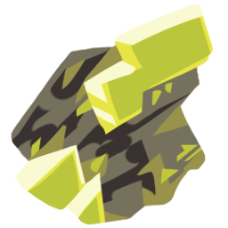

#### This is the development-oriented README. If you're looking to learn how to install and use the template, see [MANUAL.MD](https://git.oat.zone/oat/uranium-template/src/branch/main/MANUAL.md).

---

 

  <h2 style="font-size: 42px">
    
    <b>Uranium Template</b>
  </h2>

 

**Uranium Template** is a Love2D-inspired NotITG game development template, focusing on keeping things as **Lua-pure** as possible with enough abstractions to make you feel like you're not dealing with Stepmania jank at all.

But you probably already knew that; how do you develop this darn thing?

## Installation

Installation follows the same steps as [the manual installation](https://git.oat.zone/oat/uranium-template/src/branch/main/MANUAL.md#installation) - extract as a modfile, run as a modfile.

## Distribution

During distribution, there are a couple of files that should be left out:

- This very `README.md` - keeping it will be a little confusing, I think!

## Development

Everything related to the core functionality - loading actors, callbacks - goes in `template/main.xml`. It's not the most convinient, but I want to eventually move this out to its own Lua file.

Everything related to the standard library should go into `template/stdlib/` - all files there are manually required in `template/stdlib/index.lua`.